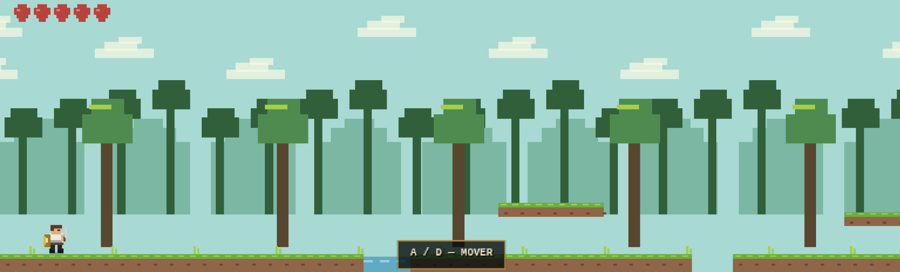
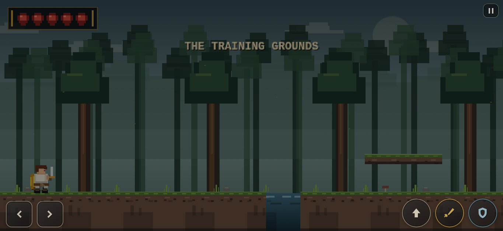
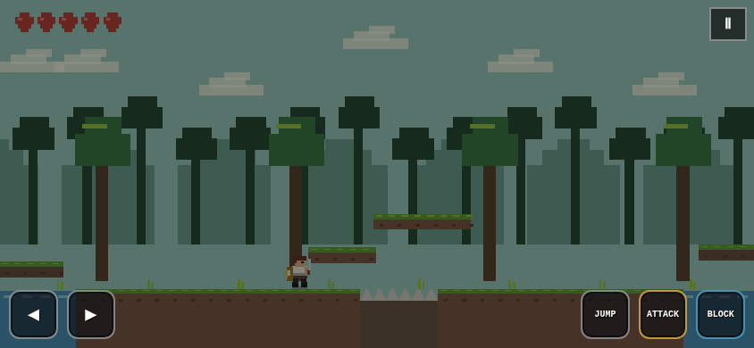
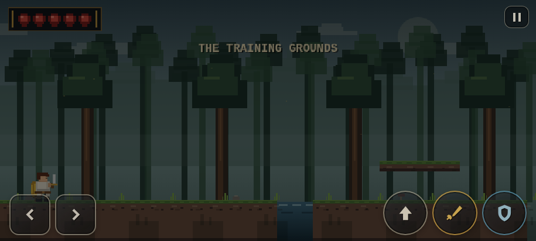

# Knights of the Renaissance

**Current version: V2 — Mobile Responsive + Gameplay & Visual Evolution**

**Knights of the Renaissance** is a short browser-based action-platformer and playable prologue created by **Gustavo Vitor / Vigu Studio**.

The project is built entirely with **HTML5, CSS3, JavaScript, Canvas API, and Web Audio API**, with no framework, backend, build step, or external game assets required. It is designed to run directly on **GitHub Pages**.

V2 is the first major visual, animation, HUD, gameplay-feel, and mobile-control overhaul of the demo. The goal is to preserve the original five-stage concept while moving the project closer to the presentation quality and responsiveness expected from a polished retro-inspired action platformer.

---

## V1 vs V2 — Visual Comparison

### Desktop — V1



The original version established the core gameplay loop, five-stage structure, sword-and-shield combat, platforming, checkpoints, bilingual interface, and final boss concept. Its visuals were intentionally simple and highly procedural, with basic geometric trees, platforms, character shapes, and a minimal HUD.

### Desktop — V2



V2 introduces a much stronger visual identity with a darker layered forest, denser scenery, atmospheric depth, improved character readability, redesigned HUD elements, better environmental detail, and more polished combat presentation.

### Mobile — V1



The first mobile implementation used large text-labeled controls such as **JUMP**, **ATTACK**, and **BLOCK**. Although functional, the controls consumed too much screen space and were less comfortable on real landscape phones.

### Mobile — V2



V2 replaces the text-heavy controls with an icon-based layout designed for landscape phones: directional arrows for movement, an up arrow for jump, a sword for attack, and a shield for block. Touch targets are larger, better spaced, and more suitable for simultaneous multi-touch input.

---

## What Improved in V2

### Visual Direction

V2 significantly upgrades the presentation while keeping the project original and lightweight.

- Added a more atmospheric layered forest with multiple depth planes.
- Added haze, background silhouettes, foreground vegetation, richer tree rendering, stones, roots, ruins, environmental motes, and improved water/hazard presentation.
- Improved contrast between the player, enemies, platforms, and background.
- Reworked the final boss area so it reads as a dedicated open clearing instead of another standard forest section.
- Preserved the project's original identity while drawing inspiration from the readability and atmosphere of classic gothic action-platformers.

### Character Animation

The protagonist is no longer presented as an almost static block-style sprite.

V2 improves the visual language of movement with:

- visible leg movement while running;
- clearer body motion and weight transfer;
- dedicated jump and falling poses;
- landing compression and recovery;
- clearer idle posture;
- improved sword attack animation;
- visible sword arc during attacks;
- stronger shield-defense pose;
- clearer hurt and combat feedback.

Enemies also receive more readable silhouettes, movement, weapons, cloth/cape motion, and attack telegraphs.

### Combat & Game Feel

Combat has been refined to feel more responsive and easier to read.

- Improved sword swing presentation and timing feedback.
- Stronger visual impact when attacks connect.
- Better defensive feedback when the shield blocks an attack.
- Short hit-stop and subtle screen shake where appropriate.
- Lightweight particles for attacks, blocking, landing, and environmental feedback.
- Improved enemy telegraphs and clearer attack states.
- Better boss presentation and aerial counter feedback.

### HUD & Interface

The HUD has been redesigned to feel more like part of a finished game.

- Framed health display.
- Improved heart presentation.
- More dramatic boss health bar.
- Refined tutorial messages and contextual panels.
- Improved title, pause, Options, and mobile-orientation screens.
- Better visual consistency between gameplay and menus.

### Mobile Controls

Mobile usability is one of the biggest V2 improvements.

**V1 controls:**

- text-heavy action buttons;
- larger visual obstruction;
- less comfortable spacing on some phones;
- weaker support for simultaneous inputs.

**V2 controls:**

- icon-only left/right movement buttons;
- up-arrow jump button;
- sword attack button;
- shield block button;
- larger touch targets;
- improved spacing for landscape phones;
- semi-transparent presentation that obstructs less of the game;
- safe-area-aware positioning;
- pointer capture and per-pointer tracking for more reliable multi-touch input;
- improved behavior for combinations such as **move + jump + attack**.

The mobile layout was specifically reviewed using a **Redmi Note 13-class landscape viewport** as a practical reference.

### Responsive Layout

V2 improves support for:

- desktop monitors;
- notebooks;
- tablets;
- Android phones;
- wide landscape displays;
- portrait-to-landscape mobile transitions.

The game uses an adaptive internal canvas so the scene can fill different aspect ratios without simply stretching the pixel art.

On portrait phones, the game displays a dedicated landscape-orientation screen and can request fullscreen/orientation lock when the browser supports it.

### Gameplay Reliability

V2 preserves the gameplay fixes introduced during the V1.x development cycle, including:

- reachable mandatory jumps;
- safer platform routes;
- corrected spike hitboxes;
- real 2D collision checks for runner enemies;
- vertical validation for melee attacks;
- safer enemy placement after hazard crossings;
- reduced unfair enemy aggro across gaps;
- resetting falling platforms;
- improved checkpoint behavior;
- prevention of several progression soft-locks;
- boss arena boundaries;
- improved aerial boss counter behavior.

---

## Story

The Third Kingdom survived a war against the last great dragon, but victory nearly destroyed the legendary **Knights of the Renaissance**.

Years later, beyond the kingdom's borders, a young warrior trains with only a sword, a shield, and unanswered questions about a past that has never been fully revealed.

This demo is designed as a **playable prologue** to a larger future project.

---

## Demo Structure

The current demo contains five connected stages:

1. **The Training Grounds** — movement, jumping, attacking, and blocking tutorial.
2. **The Forest Path** — platforming, hazards, and moving terrain.
3. **Combat Trial** — enemy waves and combat fundamentals.
4. **Dangerous Path** — platforming combined with melee and ranged enemies.
5. **The Clearing** — final training battle against the Old Man.

The experience continues into a final dialogue, cliffhanger, and scrolling credits.

---

## Controls

| Action | Keyboard |
| --- | --- |
| Move | `A` / `D` or `←` / `→` |
| Jump | `Space`, `W`, or `↑` |
| Attack | `J` or `X` |
| Block | `K` or `C` |
| Pause | `Esc` or `P` |
| Continue dialogue | `Enter`, `Space`, or `E` |

### Touch Controls

On supported touch devices, V2 automatically displays:

- **← / →** — movement
- **↑** — jump
- **Sword icon** — attack
- **Shield icon** — block
- **Pause icon** — pause

---

## Languages

The game supports:

- **English**
- **Português (Brasil)**

The language can be changed from the main menu, pause menu, or Options screen. The selected language is stored with `localStorage` and restored on the next visit.

---

## Technologies

- HTML5
- CSS3
- JavaScript (ES6+)
- Canvas API
- Web Audio API
- `localStorage`

No framework, package manager, backend, or build system is required.

---

## Running Locally

For behavior closest to GitHub Pages, run a small static server inside the project folder:

```bash
python3 -m http.server 8080
```

Then open:

```text
http://localhost:8080
```

---

## GitHub Pages

1. Upload all project files and the four preview images to the repository root.
2. Open **Settings → Pages**.
3. Under **Build and deployment**, choose **Deploy from a branch**.
4. Select the `main` branch and `/ (root)`.
5. Save and wait for the deployment URL.

No build step is required.

---

## Performance

The project remains intentionally lightweight despite the V2 visual upgrade.

It uses:

- `requestAnimationFrame()` for the main loop;
- adaptive low-resolution Canvas rendering;
- pixel-perfect scaling;
- capped large frame deltas;
- controlled particle counts;
- removal of expired projectiles and particles;
- limited DOM work during gameplay;
- optional **Reduced Effects** mode for weaker devices.

---

## Version History

### V2 — Mobile Responsive + Gameplay & Visual Evolution

- Major visual redesign.
- More detailed and atmospheric environments.
- Improved procedural character artwork.
- Visible running-leg animation and clearer jump/fall poses.
- Better sword attacks and shield-defense presentation.
- Redesigned HUD and boss health bar.
- Icon-based mobile controls.
- Improved multi-touch handling.
- Better mobile spacing and safe-area behavior.
- Improved responsive Canvas behavior.
- Improved final boss presentation.
- Preserved the gameplay reliability fixes from V1.1 and V1.2.

### V1.2 — Gameplay Reliability Pass

- Fixed invisible air damage from runner enemies.
- Added real two-dimensional collision validation.
- Improved melee vertical-range checks.
- Adjusted spike collision areas.
- Improved enemy placement around mandatory crossings.
- Added falling-platform reset behavior.
- Improved boss arena and aerial-counter reliability.

### V1.1 — Gameplay & Mobile Fixes

- Reworked mandatory platform routes.
- Improved jump reliability.
- Added adaptive fullscreen layout.
- Added portrait orientation guidance.
- Improved menu spacing on short landscape displays.

### V1 — Initial Playable Demo

- Five playable stages.
- Sword and shield combat.
- Platforming and hazards.
- Checkpoints.
- Final boss.
- English / Brazilian Portuguese localization.
- Intro, dialogue, ending, and credits.

---

## Project Status

**Playable Demo / Prologue — V2**

The project is still a demo connected to a larger future concept. Future versions can expand the world, exploration, enemies, progression, story, animation, and audiovisual identity beyond the current web prologue.

---

## Author

**Gustavo Vitor**  
**Vigu Studio**

## YouTube

https://www.youtube.com/@ViguStudio
