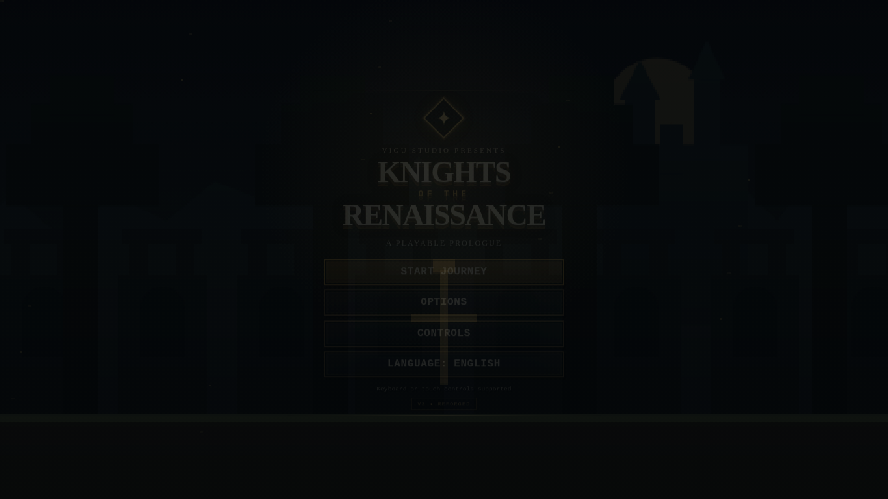
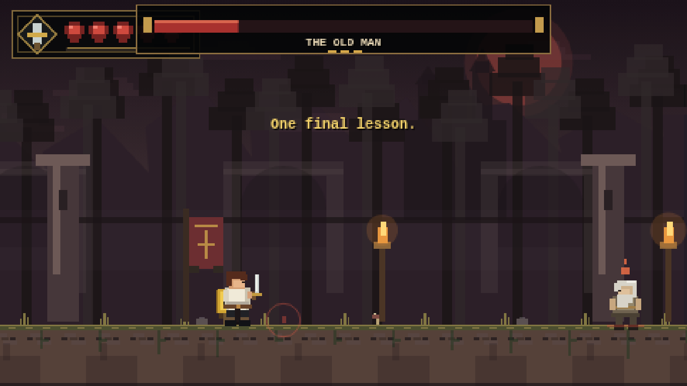
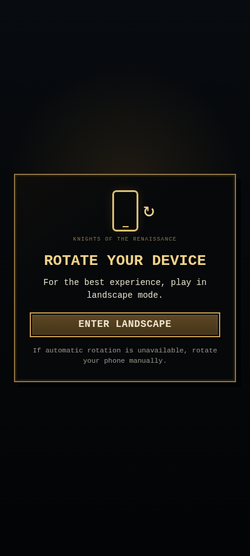

# Knights of the Renaissance

**Current version: V3.1 — Level Collision & Progression Reliability Pass**

**Knights of the Renaissance** is a bilingual browser action-platformer and playable prologue created by **Gustavo Vitor / Vigu Studio**.

V3 is the largest update to the demo so far. It keeps the existing story, sword-and-shield gameplay, localization, checkpoints, final training duel, and GitHub Pages deployment model while rebuilding the presentation around a richer medieval dark-fantasy visual target.

The project uses only **HTML5, CSS3, vanilla JavaScript, Canvas API, Web Audio API, and localStorage**. There is no framework, backend, package manager, build step, or required remote asset.

---


## V3.1 — Level Collision & Progression Reliability Pass

V3.1 is a gameplay reliability patch focused on progression blockers discovered after the V3 visual overhaul.

- Converted thin gameplay ledges into **one-way platforms**: the player can move underneath them and jump through them from below, while still landing on them from above.
- Removed the ceiling/side-wall behavior that could trap the player under decorative platforms in the Training Grounds and similar layouts.
- Preserved full collision for ground masses, walls, hazards, moving platforms, and falling platforms where appropriate.
- Re-audited the mandatory traversal route across all seven playable areas using the current movement values (`72 px/s`, `-207` jump impulse, `430` gravity).
- Checked the platform chains that bridge the wider hazard gaps in Forest Path and Dangerous Path so they remain reachable without damage exploits or pixel-perfect jumps.
- Rechecked enemy placement after major crossings to ensure landing zones remain usable before combat engages.
- Kept the V3 visual direction, mobile controls, languages, boss phases, and content unchanged.

This patch specifically addresses cases where a visually decorative ledge behaved like a solid ceiling and prevented a valid jump from progressing through the level.

## Visual Evolution — V1 → V2 → V3.1

The screenshots below show how the project evolved on both desktop and mobile. V3.1 keeps the visual overhaul introduced in V3 while adding the latest collision and progression reliability fixes.

### V1 — Desktop


V1 established the playable foundation: the original forest setting, sword-and-shield hero, five-stage structure, checkpoints, hazards, bilingual flow, and the first Old Man encounter. Its presentation was intentionally simple, with blockier scenery, a basic HUD, and limited character animation.

### V1 — Mobile


The first mobile implementation proved that the demo could run on touch devices, but the layout was still closer to a desktop game scaled down for a phone. Controls, HUD spacing, orientation handling, and safe-area behavior were still early-stage.

---

### V2 — Desktop


V2 was the first major presentation upgrade. It improved the forest rendering, hero readability, movement poses, combat feedback, HUD styling, and overall screen composition. The game started to feel less like a browser prototype and more like a small indie action-platformer.

### V2 — Mobile


V2 also rebuilt the mobile experience around icon-only touch controls. Movement uses left/right arrows, while jump, sword, and shield actions are separated into larger touch targets. Multi-touch input, fullscreen behavior, portrait guidance, and Redmi Note 13-class landscape layouts were also improved.

---

### V3.1 — Desktop (Current)


V3 introduced the largest visual and structural expansion so far. The game now uses a richer medieval dark-fantasy direction with deeper parallax, ruins, fog, banners, statues, stronger environmental storytelling, a redesigned ornamental HUD, more readable character animation, and a much broader enemy roster. The campaign was expanded from five gameplay stages to seven connected areas.

V3.1 is the current reliability pass. It preserves the V3 art direction while fixing thin ledges so they behave as **one-way platforms**: the player can jump through them from below and land on them from above instead of being trapped by an invisible ceiling or side wall. Mandatory traversal routes across all seven areas were also re-audited for progression safety.

### V3.1 — Mobile (Current)


The current mobile build keeps the V3 visual identity while maintaining large icon-only controls, independent pointer tracking for multi-touch, landscape-first gameplay, portrait rotation guidance, safe-area support, and HUD positioning designed not to compete with the action buttons.

### Current Version Comparison

| Area | V1 | V2 | V3.1 (Current) |
| --- | --- | --- | --- |
| **Visual direction** | Simple forest prototype | First major visual overhaul | Rich medieval dark-fantasy world with ruins, fog, layered scenery, and stronger atmosphere |
| **Campaign** | 5 gameplay stages | 5 refined stages | **7 connected playable areas** |
| **Hero animation** | Basic pose changes | Improved run/jump readability | More expressive running cycle, jump states, landing, block recoil, attack arcs, and tunic motion |
| **Enemies** | Small core roster | Refined original enemies | **8 enemy roles/creatures**, including Shield Guard, Bat, Dark Wolf, Crawler, and Elite Knight |
| **Combat** | Functional sword/block system | Better feedback and hit response | Better telegraphs, aerial combat, shield interactions, knockback, hit-stop, and 2D hit validation |
| **Boss** | Basic Old Man duel | Improved presentation | **Three-phase Old Man fight** with timing variation, fake preparations, dash pressure, and jumpable shockwaves |
| **HUD** | Basic hearts | Cleaner game HUD | Ornamental crest-based HUD, area marker, and expanded boss presentation |
| **Mobile** | Early responsive support | Icon controls + better landscape layout | Refined multi-touch, safe areas, portrait guidance, fullscreen support, and current gameplay visuals |
| **Progression reliability** | Initial implementation | Several jump/mobile fixes | V3.1 one-way ledges + full seven-area traversal audit |

### Additional Current V3.1 Screenshots

#### Title Screen



#### Old Man Boss Fight



#### Portrait Orientation Screen



---

## What Changed in V3

### Reference-image-driven visual overhaul

V3 uses the supplied concept image as a **visual target**, not as a static background or copied game asset. The live Canvas renderer recreates the direction with original procedural artwork:

- layered mountains, distant fortifications, forest silhouettes, fog, and near trees;
- ancient arches, statues, banners, torches, broken masonry, vegetation, and environmental details;
- a gradual transition from brighter forest areas into ruins, twilight, and a darker final arena;
- a redesigned medieval HUD with a crest, framed vitality display, stage markers, and an expanded boss bar;
- a more cinematic title screen and UI treatment.

The result stays intentionally lightweight and original rather than embedding the concept image into the gameplay.

### Seven playable areas

V3 expands the structure from five gameplay stages to **seven connected areas**:

1. **The Training Grounds** — movement, jump, sword, and shield tutorial.
2. **The Forest Path** — moving/falling platforms, hazards, and creatures.
3. **Ancient Ruins** — ruined architecture, shield enemies, ranged pressure, and aerial threats.
4. **Combat Trial** — four controlled enemy waves with mixed behaviors.
5. **Dangerous Path** — platforming, hazards, ranged enemies, beasts, and an elite fighter.
6. **Twilight Pass** — a shorter, darker transition area that prepares the final duel.
7. **The Old Man** — dedicated boss arena and final training battle.

The dialogue, cliffhanger, credits, and ending remain part of the complete flow.

### Expanded enemy roster

V3 adds or refines several distinct enemy roles:

- **Swordsman** — standard melee fighter.
- **Runner** — fast contact-pressure enemy.
- **Archer** — telegraphed ranged attacks.
- **Shield Guard** — blocks frontal sword attacks and rewards positioning/aerial play.
- **Bat** — flying threat with aerial movement.
- **Dark Wolf** — faster ground creature with a short lunge.
- **Crawler** — low-profile ruins creature.
- **Elite Knight** — tougher late-demo melee enemy with faster attack timing.

Enemy damage uses real two-dimensional overlap and attack hitboxes instead of horizontal-distance-only checks.

### Protagonist animation upgrade

The hero keeps the established design — brown hair, white tunic, dark trousers, sword, and shield — but receives a more expressive procedural sprite:

- six-step running leg cycle;
- idle breathing;
- separate jump, apex, falling, landing, hurt, attack, and block poses;
- animated tunic tails;
- larger readable sword arc;
- clearer active shield stance and block recoil;
- landing dust and movement feedback.

The collision body remains separate from the larger visual drawing so presentation can improve without making hitboxes unfair.

### Combat and game feel

V3 refines:

- sword range and visual arc;
- attack recovery;
- aerial attacks and stomps;
- enemy telegraphs;
- shield impact feedback;
- knockback;
- hit-stop;
- subtle screen shake;
- controlled particles;
- projectile blocking;
- enemy hurt/death reactions.

The project continues to prioritize readable and fair combat over visual noise.

### The Old Man — three-phase duel

The Old Man remains apparently unarmed. His body and movement are still his primary weapon, and his **leap/stomp remains unblockable**.

The duel now evolves through three pressure levels:

- **Phase 1 — 100% to 65%:** readable crouch → leap → descent → stomp → recovery pattern.
- **Phase 2 — 65% to 30%:** fake preparations, timing variation, shorter recovery, and trajectory changes.
- **Phase 3 — below 30%:** increased aggression, occasional short dash, directed leaps, and jumpable ground shockwaves after committed stomps.

The intended answer is still the original mechanic: **read the jump, jump with him, and strike him while he is airborne**.

### Mobile V3

The mobile controller remains icon-only and is refined around real landscape-phone ergonomics:

**Left side**

- `←` movement
- `→` movement

**Right side**

- `↑` jump
- sword icon — attack
- shield icon — block

The touch system tracks pointers independently, allowing combinations such as move + jump, move + attack, and jump + attack without one finger cancelling another.

Safe-area insets are respected where available.

### Portrait mode

Touch devices opened vertically receive a dedicated bilingual orientation screen. The game can request fullscreen and landscape orientation when the browser permits it; otherwise the player is instructed to rotate the device manually.

---

## Story

The Third Kingdom once stood at the edge of destruction when the last great dragon gathered creatures and forces of darkness to conquer the realm.

The legendary **Knights of the Renaissance** defeated the dragon, but the victory destroyed almost the entire order. One knight survived, crossed beyond the kingdom's border into the Isolated Lands — also called the Underworld — and disappeared.

Years later, a young warrior trains far from the kingdom with a sword, a shield, and a past that has not yet been fully revealed.

This demo is a **playable prologue** to a larger future project.

---

## Controls

| Action | Keyboard |
| --- | --- |
| Move | `A` / `D` or `←` / `→` |
| Jump | `Space`, `W`, or `↑` |
| Attack | `J` or `X` |
| Block | `K` or `C` |
| Pause | `Esc` or `P` |
| Continue dialogue | `Enter`, `Space`, or `E` |

---

## Languages

The complete playable flow supports:

- **English**
- **Português (Brasil)**

Language selection is stored in `localStorage` and can be changed from the main menu, pause menu, or Options screen without restarting the current session.

---

## Options

V3 includes:

- Music Volume
- SFX Volume
- Screen Shake
- Reduced Effects
- Fullscreen
- Language

**Reduced Effects** lowers decorative particles and optional visual effects without changing gameplay.

---

## Technologies

- HTML5
- CSS3
- JavaScript ES6+
- Canvas API
- Web Audio API
- Pointer Events
- Fullscreen API when supported
- Screen Orientation API when supported
- localStorage

---

## Performance

The game remains designed for static web hosting and moderate hardware.

Key safeguards include:

- one `requestAnimationFrame()` loop;
- capped frame delta;
- low internal Canvas resolution with pixel-perfect scaling;
- bounded particles and short-lived projectiles;
- removal of expired combat objects;
- off-screen drawing checks where practical;
- no large gameplay background images;
- no runtime network requests;
- no framework or WebGL dependency;
- optional Reduced Effects mode.

---

## Validation performed for V3

The final V3 files were checked with automated browser smoke tests and JavaScript syntax validation.

Validated in the available environment:

- all seven levels instantiate without JavaScript exceptions;
- sequential level transitions reach levels 1 → 7;
- final boss creation and three-phase state logic execute;
- Phase 3 stomp can create two jumpable shockwaves;
- boss defeat reaches final dialogue and cliffhanger state;
- English and Brazilian Portuguese data remain available;
- mobile controls remain inside a **915 × 412** landscape viewport;
- portrait orientation screen appears at **412 × 915**;
- simultaneous touch movement + jump produces both horizontal movement and a jump state;
- generated screenshots render without page errors.

The mobile layout was **validated against a Redmi Note 13-class viewport**, not physically tested on a Redmi Note 13 device.

---

## Running locally

No installation is required.

For behavior closest to GitHub Pages:

```bash
python3 -m http.server 8080
```

Then open:

```text
http://localhost:8080
```

---

## GitHub Pages

1. Upload the project files and V3 preview images to the repository root.
2. Open **Settings → Pages**.
3. Under **Build and deployment**, select **Deploy from a branch**.
4. Select the repository's default branch and `/ (root)`.
5. Save.

No build command is required.

---

## Version History

### V3 — Reforged Visual & Gameplay Overhaul

- Reference-image-driven visual direction recreated procedurally in Canvas.
- Seven connected gameplay areas.
- Ancient Ruins and Twilight Pass added.
- Eight enemy roles/creatures.
- More detailed protagonist animation and equipment readability.
- Redesigned HUD and boss presentation.
- Three-phase Old Man battle.
- Jumpable Phase 3 shockwaves and short boss dash variation.
- Richer environmental storytelling with ruins, banners, torches, statues, fortifications, fog, and parallax.
- Refined mobile controls and safe-area support.
- Fullscreen option added.
- Additional gameplay and progression validation.

### V2 — Mobile Responsive + Gameplay & Visual Evolution

- Major first visual overhaul.
- Icon-only touch controller.
- Improved multi-touch input.
- Improved protagonist running/jump poses.
- Better HUD, combat feedback, and final clearing.

### V1.2 — Gameplay Reliability Pass

- Fixed runner vertical damage wall.
- Added real 2D collision validation.
- Improved enemy attack height checks.
- Improved hazard and falling-platform reliability.
- Reduced progression soft-locks.

### V1.1 — Gameplay & Mobile Fixes

- Reworked mandatory jumps.
- Improved fullscreen responsiveness.
- Added portrait orientation guidance.

### V1 — Initial Playable Demo

- Five-stage playable prologue.
- Sword and shield combat.
- Checkpoints and hazards.
- Final Old Man encounter.
- English / Brazilian Portuguese localization.
- Intro, dialogue, cliffhanger, and credits.

---

## Project Status

**Playable Demo / Prologue — V3**

V3 remains a web prologue for a larger future **Knights of the Renaissance** project.

---

## Author

**Gustavo Vitor**  
**Vigu Studio**

## YouTube

https://www.youtube.com/@ViguStudio
