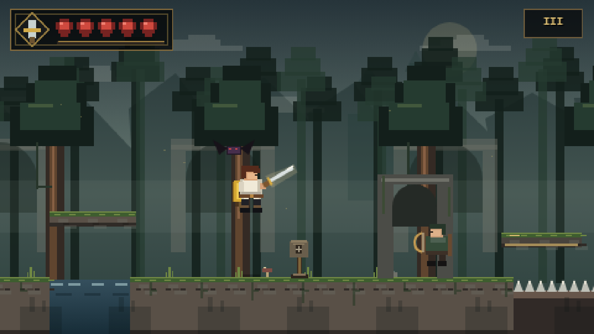
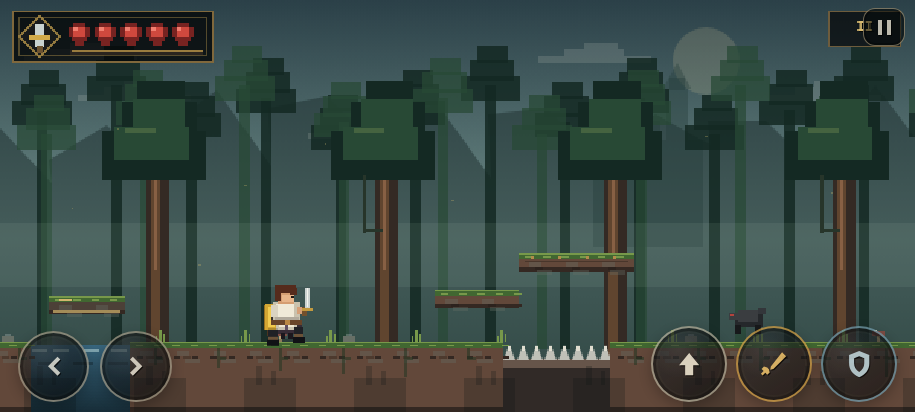
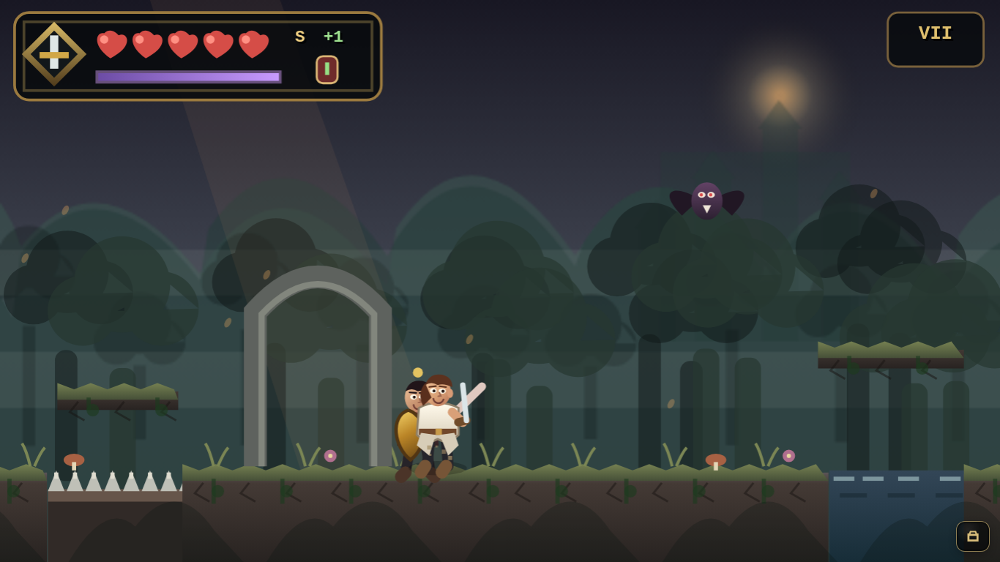
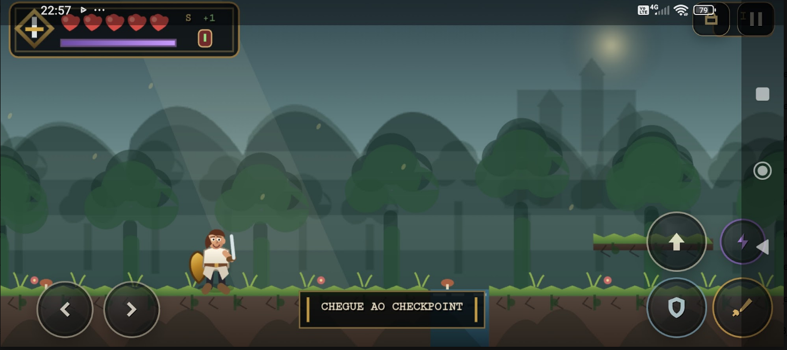

# Knights of the Renaissance — V4.1

**V4.1 Motion & Inventory** is the most complete release of the original Canvas-based branch of *Knights of the Renaissance*. It preserves the lightweight static-web architecture of the early versions while pushing the project toward a smoother **2.5D cartoon action-platformer** with sharper rendering, layered atmosphere, articulated characters, animated creatures, multiple weapons, Spirit powers, healing items, a real inventory, eight playable areas, and the three-phase Old Man encounter.

> **Project status:** Playable web prologue — V4.1 Motion & Inventory

| | V4.1 |
| --- | --- |
| **Genre** | 2D action-platformer / playable prologue |
| **Rendering** | HTML5 Canvas with high-DPI scaling |
| **Campaign** | 8 playable areas |
| **Combat** | Sword, Greatsword, Spear, shield, Spirit powers |
| **Languages** | English + Português (Brasil) |
| **Desktop / Mobile** | Keyboard + responsive multitouch controls |
| **Deployment** | Static build compatible with GitHub Pages |

## V4.1 — motion, sharpness, creature animation, and inventory

V4.1 addresses the main presentation issues discovered after the first V4 playtest:

- **Sharper full-screen Canvas output:** the backing resolution now follows the real viewport more closely instead of stretching a low-resolution buffer across large screens.
- **No forced pixelated CSS scaling:** the cartoon renderer stays anti-aliased and uses a higher desktop render cap while keeping a lower mobile cap for performance.
- **60 FPS gameplay cap / 30 FPS static screens:** prevents unnecessary 90/120/144 Hz redraws and reduces background CPU/GPU load.
- **Cached atmospheric background:** static sky, mountains, fortress, distant forest, moon/sun glow, and fog are pre-rendered and reused; only the near parallax layers animate each frame.
- **Distance-driven locomotion:** player and ground-enemy leg cycles now advance from real movement distance instead of only elapsed time, reducing the sliding / disconnected-feet look.
- **More expressive player face:** visible eye whites, pupils, eyebrows, nose, mouth, hair volume, ear, and stronger attack expressions.
- **Creature animation pass:** bats flap continuously, wolves use leg/tail movement, crawlers scuttle with animated limbs, and humanoid enemies use articulated movement and action-specific poses.
- **Readable enemy faces:** humanoid enemies now have visible facial features and stronger attack telegraphs.
- **Old Man face polish:** the mentor has clearer eyes/brows on top of the existing V4 phase animations.
- **Real inventory screen:** press `I` or use the bag button to open a dedicated inventory containing healing items, Spirit, unlocked weapons, equipped weapon state, and unlocked powers.
- **Inventory actions:** Healing Draughts can be consumed from the inventory and unlocked weapons can be equipped directly from it.
- **Cleaner mobile combat cluster:** healing and weapon selection move into the inventory UI, leaving Jump, Power, Block, and Attack as the four primary right-thumb actions.

V4.1 keeps all eight areas, the three weapon archetypes, Spirit powers, healing pickups, bilingual EN/PT-BR support, and the three-life-bar Old Man boss from V4.


## Visual Evolution — V1 → V2 → V3 → V4.1

The screenshots below document how the project evolved on **desktop and mobile**. V4.1 is the current build in the V4 branch, combining the large V4 gameplay expansion with the later motion, rendering, creature-animation, and inventory improvements.

For the current V4.1 showcase, the README uses **clean presentation crops** from the real gameplay capture. They focus on the HUD, level composition, atmosphere, hazards, creatures, and mobile controls instead of using a close-contact combat frame where two character silhouettes can visually overlap.

### V1 — Desktop


V1 established the playable foundation: a young sword-and-shield hero, the forest setting, hazards, checkpoints, five stages, bilingual progression, and the first Old Man encounter. The presentation was intentionally simple, with block-based scenery, limited character articulation, a basic HUD, and a smaller enemy vocabulary.

### V1 — Mobile


The first responsive version proved that the game could run on phones, but touch controls, orientation handling, HUD spacing, and landscape composition were still experimental.

---

### V2 — Desktop


V2 was the first major presentation pass. It improved forest depth, character readability, running and jumping poses, combat feedback, HUD styling, boss presentation, and the overall feeling of a browser game becoming a small action-platformer.

### V2 — Mobile


V2 introduced the cleaner icon-based touch layout, larger action targets, better landscape framing, pointer-based multi-touch, portrait guidance, and a more practical mobile HUD.

---

### V3 — Desktop



V3 expanded the world into a richer medieval dark-fantasy presentation. The campaign grew to seven areas, scenery gained ruins, fog, banners, statues and deeper parallax, the enemy roster expanded, the hero received more expressive animation, and the Old Man fight became a substantially more involved encounter.

### V3 — Mobile



The V3 mobile build retained large icon-only controls while combining the expanded world, richer HUD and more complex encounters with multi-touch and landscape-first play.

---

### V4.1 — Desktop — Current



The refreshed desktop showcase highlights the current **HUD, atmospheric forest depth, ruins, hazards, platforms, creature presentation, and area framing** without relying on a close-range combat moment as the primary project image.

V4 changes the rendering direction from the older blocky/pixel-like prototype toward a smoother **2.5D-cartoon-inspired side-scroller**. V4.1 sharpens that direction with high-DPI rendering, anti-aliased shapes, atmospheric depth, more organic silhouettes, readable faces, articulated movement, animated monsters, a larger HUD, Spirit mechanics, multiple weapons, healing items, and the dedicated Inventory.

The world contains **eight playable areas**, including the Old Sanctum, and the final Old Man encounter uses **three complete life bars / phases** with Body, Shadow, and Spirit mechanics.

### V4.1 — Mobile — Current



The mobile showcase now emphasizes the parts that matter most for the responsive build: the compact vitality/Spirit HUD, landscape composition, directional controls, Jump, Power, Block, Attack, Inventory access, and safe spacing around the screen edges.

The current mobile layout keeps immediate combat actions under the thumbs while moving healing, weapon management, and power information into the Inventory. Safe-area-aware UI, landscape framing, and independent pointer tracking remain part of the touch design.

### Screenshot presentation note

The V4.1 README intentionally uses **showcase crops rather than collision-close combat frames**. This keeps the repository overview focused on the art direction, level readability, HUD, responsive controls, and atmosphere while the detailed gameplay systems are documented in the sections below.

### What is better in the current version?

| Area | V1 | V2 | V3 | V4.1 — Current |
| --- | --- | --- | --- | --- |
| **Art direction** | Simple block-based forest | First visual overhaul | Medieval dark-fantasy / ruins | **Smooth 2.5D-cartoon-inspired presentation with atmospheric depth** |
| **Rendering** | Basic Canvas shapes | Improved procedural visuals | Deeper parallax and environment | **Sharper high-DPI Canvas, anti-aliased output, cached background layers** |
| **Player** | Basic poses | Better run/jump readability | More expressive procedural animation | **Readable face, articulated legs/body, distance-driven locomotion, stronger attacks and defensive poses** |
| **Enemies / creatures** | Small core roster | Refined originals | Expanded roles and creatures | **Animated bats, wolves, crawlers and humanoid enemies with faces and action-specific motion** |
| **Campaign** | 5 stages | 5 refined stages | 7 areas | **8 playable areas, including the Old Sanctum** |
| **Weapons** | Knight Sword | Knight Sword | Knight Sword | **Knight Sword + Renaissance Greatsword + Sanctum Spear** |
| **Items** | None | None | None | **Healing Draughts, Spirit pickups, unlock pickups and progression items** |
| **Powers** | None | None | Limited movement/combat base | **Shadow Step, Air Burst, Guard Burst and Energy Slash** |
| **Inventory** | None | None | None | **Dedicated inventory for healing, weapons, Spirit and powers** |
| **Boss** | Basic Old Man duel | Better presentation | Multi-phase behavior | **Three full life bars: Master of Body, Shadow and Spirit** |
| **HUD** | Basic hearts | Cleaner styled HUD | Ornamental medieval HUD | **Vitality + Spirit + weapon + healing + area + multi-phase boss HUD** |
| **Mobile** | Early touch support | Icon-based controls | Refined multi-touch | **Cleaner combat cluster + Inventory + safe-area-aware responsive layout** |
| **Performance** | Early engine | Better optimization | More content | **60 FPS gameplay cap, 30 FPS static screens and cached atmospheric backdrop** |

### Why V4.1 is the strongest build so far

V4.1 is not only a visual revision. It combines the biggest gameplay expansion of V4 with a focused motion/performance pass:

- sharper rendering without low-resolution fullscreen stretching;
- smoother non-pixelated cartoon presentation;
- facial features for the hero, humanoid enemies, and the Old Man;
- movement cycles driven by actual travel distance instead of only elapsed time;
- animated creature locomotion and attack telegraphs;
- three distinct weapon archetypes;
- healing items and a dedicated inventory;
- Spirit resource and unlockable powers;
- eight playable areas;
- a three-phase, three-life-bar Old Man boss fight;
- cleaner mobile controls and inventory access;
- reduced redundant rendering work through cached background scenery and frame caps.

This makes the current build considerably closer to the long-term goal: a lightweight browser action-platformer with a stronger character identity, deeper systems, better animation and a more immersive 2.5D-cartoon atmosphere while remaining deployable as a static GitHub Pages project.

## About

*Knights of the Renaissance* is a bilingual action-platformer prologue set before a larger planned project. The demo follows a young swordsman training far beyond the borders of the Third Kingdom, while the ruins, symbols, enemies, and final mentor battle hint at a much larger history surrounding the fallen Knights of the Renaissance.

V4 keeps the original story and progression philosophy, but significantly expands the playable systems and visual direction.

## V4 visual direction

V4 is built around a new **2.5D cartoon illusion** rather than real 3D. The game still uses the Canvas API, but the rendering is now composed with smoother anti-aliased shapes, gradients, atmospheric layers, organic silhouettes, parallax depth, foreground framing, fog, distant mountains, castle silhouettes, richer vegetation, ruins, and more expressive character rendering.

Key visual changes include:

- High-DPI Canvas backing resolution while keeping a stable logical gameplay resolution
- Smooth antialiased cartoon rendering instead of intentionally pixelated output
- Layered sky, mountains, distant castle, fog, forests, ruins, playable terrain, vegetation, and foreground silhouettes
- More organic terrain surfaces, stone edges, grass, vines, flowers, mushrooms, banners, statues, arches, and torches
- Reworked player silhouette with visible leg motion, cloth movement, more readable poses, shield volume, and weapon arcs
- More expressive enemy silhouettes and clearer telegraphs
- Medieval/cartoon HUD with crest, vitality, spirit gauge, current weapon, healing item counter, level marker, and segmented boss bars
- Stronger boss presentation and phase colors

The visual target is the atmosphere and composition of the V4 reference concept, while keeping the actual implementation lightweight and original.

## Campaign

V4 expands the prologue to **8 playable areas**:

1. **The Training Grounds** — movement, jumping, attack, block, first healing item, and the first power unlock
2. **The Forest Path** — platforming, hazards, creatures, energy pickups, and aerial mobility progression
3. **Ancient Ruins** — larger ruins, new enemy combinations, and the Greatsword unlock
4. **Combat Trial** — multi-wave combat arena and Guard Burst progression
5. **Dangerous Path** — platforming plus ranged pressure, hazards, elite enemies, and the Sanctum Spear unlock path
6. **Twilight Pass** — darker atmosphere, reduced visual safety, stronger enemy mixes, and preparation for the final region
7. **The Old Sanctum** — a new V4 area with ruins, elites, ranged enemies, creatures, hazards, and final preparation pickups
8. **The Old Man** — a three-life-bar mentor boss fight

The campaign still ends with the dialogue, cliffhanger, credits, and Vigu Studio / YouTube callout.

## Combat V4

The combat system keeps the original sword-and-shield foundation while adding more readable timing and more gameplay choices.

### Weapons

V4 supports a small weapon set with different combat identities:

| Weapon | Identity |
| --- | --- |
| **Knight Sword** | Balanced speed, reach, and recovery |
| **Renaissance Greatsword** | Slower attacks, wider range, heavier damage |
| **Sanctum Spear** | Longest reach and safer spacing |

Weapons are not cosmetic swaps. Range, attack duration, cooldown, damage profile, and attack presentation are different.

**Switch weapon:** `Q` on keyboard, or open the Inventory (`I` / bag button) and equip an unlocked weapon directly.

### Blocking

Blocking remains a core mechanic. Front-facing blockable attacks can be stopped with the shield, with recoil and impact feedback. Unblockable attacks — most importantly the Old Man's primary stomp — still require movement and timing instead of holding the shield.

### Energy Slash

When Guard Burst progression is available, holding `R` during an attack can release a short-range spirit slash if enough Spirit is available.

## Spirit powers

V4 adds a lightweight **Spirit** resource shown in the HUD. Spirit regenerates gradually and powers special movement/defensive mechanics.

### Shadow Step

Unlocked early in the run.

- Fast ground dash
- Brief defensive movement window
- Useful for repositioning and avoiding enemy pressure
- Uses Spirit

**Keyboard:** `Shift` or `L`

### Air Burst

Unlocked during the early campaign.

- Allows an additional aerial burst / second jump
- Improves exploration and recovery
- Uses Spirit

Activate by pressing Jump again while airborne after the power is unlocked.

### Guard Burst

Unlocked later in the campaign.

- Hold Block and activate Power
- Emits a close defensive burst
- Damages nearby normal enemies
- Uses more Spirit than Shadow Step

## Healing items

V4 adds **Healing Draughts**.

- Healing items appear as visible pickups in several areas
- The player can carry a limited number
- A draught restores up to two health points
- Healing can be used from the dedicated inventory or through the optional keyboard shortcut.

**Keyboard shortcut:** `H`

**Inventory:** `I`

The current number of Healing Draughts is displayed in the HUD.

## Pickups and progression

The campaign now contains visible pickups for:

- Healing Draughts
- Spirit restoration
- Power awakenings
- Greatsword unlock
- Spear unlock

Critical progression also has safe fallbacks between levels so the player cannot permanently miss a mandatory mechanic and soft-lock the demo.

## Enemy roster

The V4 build retains and visually refines multiple enemy roles:

- Swordsman
- Runner
- Archer
- Shield Guard
- Bat
- Dark Wolf
- Crawler
- Elite Knight

Difficulty is based on movement, positioning, enemy combinations, attack telegraphs, ranged pressure, and level geometry rather than simply increasing enemy HP.

## The Old Man — V4 boss

The Old Man is now a genuine **three-phase / three-life-bar boss fight**.

### Phase I — Master of Body

The first bar focuses on the original core mechanic:

- Read the crouch telegraph
- Anticipate the leap
- Avoid the unblockable stomp
- Meet the Old Man in the air and strike during the vulnerability window
- Jump over the resulting ground shockwaves

### Phase II — Master of Shadow

The second bar adds mobility deception:

- Shadow Step dashes
- Afterimages
- Faster repositioning
- Fake jump preparation
- Shorter recovery windows

### Phase III — Master of Spirit

The final bar combines the earlier patterns with a third power:

- Spirit projectiles
- Faster pressure
- Shadow movement
- Heavy leaps
- Shockwaves
- Stronger arena control

Spirit projectiles can be defended when approached correctly, while the primary stomp remains unblockable.

Each phase has its own full health segment and an explicit HUD identity. Depleting one bar triggers a phase transition instead of ending the fight.

## Controls

### Keyboard

| Action | Controls |
| --- | --- |
| Move | `A / D` or `← / →` |
| Jump | `Space`, `W`, or `↑` |
| Attack | `J` or `X` |
| Block | `K` or `C` |
| Power / Shadow Step / Guard Burst | `Shift` or `L` |
| Heal | `H` |
| Switch weapon | `Q` |
| Energy Slash | Hold `R` during an attack |
| Inventory | `I` |
| Pause | `Esc` or `P` |
| Continue dialogue | `Enter`, `Space`, or `E` |

### Mobile

The V4 touch layout remains icon-based and supports multitouch.

**Left:**

- Left arrow
- Right arrow

**Right:**

- Jump
- Attack
- Block
- Power

**Top-right:**

- Inventory bag button
- Pause button

Healing items, weapon selection, and unlocked powers are visible inside the inventory, which keeps the two-thumb combat cluster smaller and easier to use.

## Mobile and responsive behavior

- Portrait devices receive a dedicated rotate-to-landscape screen
- Fullscreen and orientation lock are requested where the browser allows it
- Manual rotation instructions remain available when the browser blocks orientation locking
- Touch controls use Pointer Events for simultaneous movement and actions
- Safe-area environment insets are respected by the CSS layout
- Internal Canvas rendering adapts to viewport aspect ratio without stretching the logical game world
- Rendering scale is capped to avoid excessive mobile GPU load

The layout is designed around common landscape phone sizes, including Redmi Note 13-class viewports. This is a viewport-targeted validation target, not a claim of physical-device laboratory testing.

## Languages

The full game supports:

- **English**
- **Português (Brasil)**

The selected language remains stored in `localStorage` and updates menus, tutorials, story, boss text, credits, mobile orientation UI, item notices, power notices, and weapon names.

## Performance

V4 remains a static, lightweight web game.

Performance safeguards include:

- `requestAnimationFrame()` game loop
- Maximum 2× backing render scale
- Stable logical gameplay resolution
- No real-time 3D engine
- No WebGL framework
- No external runtime dependencies
- Controlled particle counts
- Cleanup of temporary projectiles and effects
- Reduced Effects option
- Parallax and 2.5D depth created with lightweight Canvas composition rather than expensive 3D geometry

## Technologies

- HTML5
- CSS3
- Vanilla JavaScript
- Canvas API
- Web Audio API
- `localStorage`
- Pointer Events
- Fullscreen / Screen Orientation APIs when available

No npm install, backend, database, or build process is required.

## Run locally

You can open `index.html` directly in a modern browser, although a local server is recommended for browser-consistent testing:

```bash
python3 -m http.server 8000
```

Then open:

```text
http://localhost:8000
```

## Project structure

```text
Knights-of-the-Renaissance/
├── index.html
├── style.css
├── game.js
├── favicon.svg
└── README.md
```

The V4 code intentionally keeps the deployment structure compact even though the internal game systems are broader than previous versions.

## Evolution

### V1

- Original playable web prologue
- Basic forest presentation
- Five-stage progression
- Initial sword/shield combat
- Initial Old Man boss concept

### V1.1 / V1.2

- Mobile and responsive corrections
- Level reachability fixes
- Collision reliability fixes
- Removal of invisible damage/progression blockers

### V2

- Major visual polish pass
- Improved mobile icon controls
- Better movement presentation and HUD
- Refined enemies and boss presentation

### V3 / V3.1

- Seven-area campaign
- Medieval atmospheric direction
- Expanded enemy roster
- Richer ruins and scenery
- Three-stage behavior progression for the Old Man
- One-way platform reliability pass

### V4 Ascendant

- New 2.5D-cartoon rendering direction
- High-DPI smooth Canvas presentation
- Eight playable areas including **The Old Sanctum**
- Spirit resource system
- Healing items
- Three player powers
- Three weapon identities
- Expanded mobile controller
- Stronger combat presentation
- Three separate Old Man life bars
- Old Man Body / Shadow / Spirit power phases
- New phase-specific boss attacks and spirit projectiles
- Reworked HUD for life, Spirit, healing inventory, weapon state, level state, and segmented boss health

## Validation performed for this build

The V4 source was checked with Node's JavaScript syntax checker. A DOM/Canvas test harness was also used to instantiate the game systems without a browser renderer and verify:

- All eight level definitions instantiate successfully
- The new Old Sanctum level is reachable in the campaign structure
- Pickups are generated for the intended areas
- Power progression fallback state advances through the campaign
- Sword, Greatsword, and Spear unlock states can coexist correctly
- The V4 Old Man starts with Phase I and transitions through Phase II and Phase III
- Each boss phase receives a fresh life bar
- The boss reaches the defeated state only after the third bar is depleted
- V4 render methods can be executed against a mocked Canvas context without throwing JavaScript exceptions

A headless Chromium screenshot pass could not be completed reliably in the current execution environment, so the included validation should not be interpreted as a physical-device visual playtest. A real-browser playthrough is still recommended before tagging a final release.

YouTube: https://www.youtube.com/@ViguStudio

---

*The journey has only just begun.*
