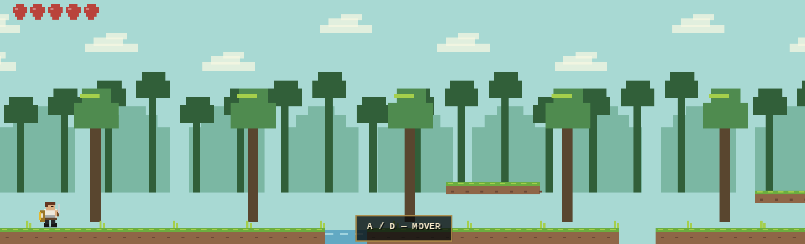
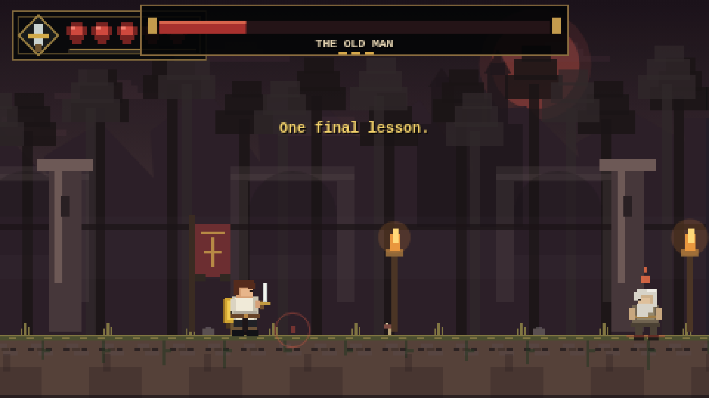
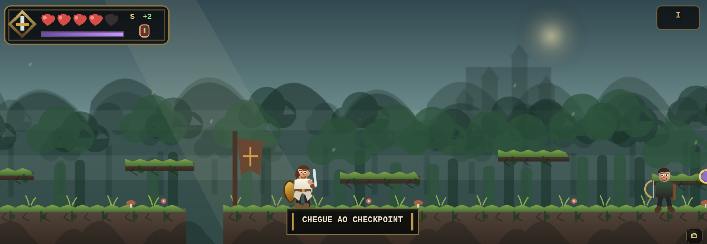
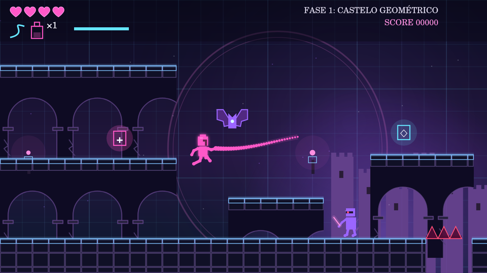

# Knights of the Renaissance — Serpent Whip V5.3

> **Current release:** Serpent Whip V5.3  
> **Genre:** 2D action-platformer / playable web prologue  
> **Platform:** Desktop + mobile browser  
> **Rendering:** HTML5 Canvas  
> **Languages:** English + Português (Brasil)  
> **Deployment:** Static project, compatible with GitHub Pages

*Knights of the Renaissance* started as a small browser action-platformer and has evolved through several visual, gameplay, combat, mobile, and performance revisions.

The current **V5.3 Serpent Whip** branch keeps the lightweight static-web structure while moving the combat toward a more distinctive whip-based identity, improving aerial mobility, collision reliability, enemy damage behavior, boss readability, and overall gameplay responsiveness.

---

## Current V5.3 Highlights

- Serpent-style segmented whip combat with anticipation, extension, sweep, and retraction.
- The whip is visible **only while attacking** and retracts completely back to the player's hand.
- The hand and first whip segment share the same position, facing direction, and walk oscillation during the whole attack/recovery sequence.
- Improved bat contact behavior: attack cooldown begins only after actual damage or a successful block.
- Old Man Phase I shockwaves are aligned with their real damage area and remain jumpable.
- Old Man Phase I melee reach works symmetrically to the left and right.
- Double jump is available from the start.
- `L` / `Shift` can trigger the aerial second jump with a forward dash.
- Three unlockable whip variants: **Serpent**, **Embers**, and **Astral**.
- Eight playable areas, inventory, checkpoints, bilingual UI, and touch controls are preserved.
- Fixed-step gameplay simulation at 120 Hz with rendering capped at 60 FPS.
- Cached scenery, controlled particles, off-screen enemy culling, and pause-on-focus-loss behavior reduce unnecessary work.

---

# Visual Evolution

The screenshots below show representative milestones in the project's evolution.

## V1 — Original Forest Prototype



The first version established the core concept:

- simple forest environment;
- basic platforming;
- sword-and-shield character;
- hearts-based health;
- checkpoints;
- early hazards;
- five-stage progression;
- first version of the Old Man encounter.

The presentation was intentionally minimal, using simple block-based scenery and limited animation.

---

## V2 — First Major Polish Pass

V2 focused on making the original prototype feel more like a complete browser action-platformer.

Main improvements included:

- stronger HUD presentation;
- improved running and jumping readability;
- cleaner combat feedback;
- better boss presentation;
- refined forest depth;
- improved mobile controls;
- larger touch targets;
- more practical landscape framing.

V2 kept the original game structure while improving presentation and usability.

---

## V3 / V3.1 — Medieval Dark-Fantasy Expansion



V3 expanded both the world and the tone of the game.

Major changes included:

- campaign expanded to seven areas;
- darker medieval atmosphere;
- ruins, banners, fog, statues, and deeper parallax;
- expanded enemy roster;
- more expressive player animation;
- more involved Old Man encounter;
- improved one-way platform reliability;
- stronger combat and environmental readability.

This branch gave the project a much clearer medieval identity.

---

## V4 / V4.1 — Ascendant, Motion & Inventory



V4 was the largest systemic expansion before the Serpent Whip branch.

### Visual improvements

- new smoother **2.5D cartoon-inspired** presentation;
- high-DPI Canvas rendering;
- anti-aliased shapes instead of intentionally pixelated fullscreen scaling;
- atmospheric sky, mountains, forest, ruins, fog, and castle silhouettes;
- more organic terrain and vegetation;
- articulated player and enemy movement;
- readable character faces;
- animated bats, wolves, crawlers, and humanoid enemies.

### Gameplay improvements

- campaign expanded to **eight playable areas**;
- dedicated inventory;
- Healing Draughts;
- Spirit resource;
- multiple powers;
- Knight Sword;
- Renaissance Greatsword;
- Sanctum Spear;
- three-life-bar Old Man boss;
- Body, Shadow, and Spirit boss phases.

### Performance improvements

- 60 FPS gameplay cap;
- 30 FPS cap for static screens;
- cached atmospheric background;
- controlled particle counts;
- reduced redundant rendering work;
- viewport-aware Canvas scaling.

V4.1 was the most complete version of the original sword-and-shield Canvas branch.

---

# V5 — Serpent Whip Combat Direction

## V5 Base

V5 changes the combat identity around a segmented whip while preserving the browser-first structure of the project.



The current visual direction combines:

- geometric castle architecture;
- cyan-edged platforms and bricks;
- purple silhouettes;
- large circular background forms;
- brighter combat readability;
- a more arcade-like contrast between the player, enemies, hazards, and environment.

The whip uses the same calculated points for both rendering and collision, helping the visible strike correspond more closely to the real hit area.

Each enemy can receive a maximum of one hit from the same whip attack.

---

## V5.2 — Whip Arc + Aerial Dash Update

V5.2 focused on making the whip and aerial movement more expressive.

### Whip attack

The attack now:

1. rises vertically;
2. transitions into a descending sweep;
3. reaches a horizontal finishing position;
4. follows the movement with delayed segments;
5. retracts back toward the player.

Intermediate collision samples are checked during the fast downward sweep to reduce missed hits.

### Double Jump + Dash

While airborne:

- jump normally with `Space`, `W`, or `↑`;
- press `L`, `Shift`, or the mobile Power control to trigger the second jump with a forward dash;
- the dash follows `A / D` when held;
- otherwise it follows the direction the player is facing.

The aerial dash:

- costs no energy;
- can only happen once before landing;
- shares the same second-jump allowance as the normal double jump;
- cannot create a third jump;
- resets after landing.

On the ground, `L` / `Shift` continues to work as the standard dash.

---

## V5.3 — Whip Anchoring + Damage Reliability Update

V5.3 focuses on fixing combat inconsistencies discovered during playtesting.

### Whip

- hidden completely while idle;
- appears only during the attack;
- retracts all the way to the player's hand;
- the first segment remains anchored to the animated hand;
- walking oscillation and facing direction remain synchronized during recovery.

### Bats

Bat attack cooldown now starts only after:

- the player actually receives contact damage; or
- the contact is successfully blocked.

Simply approaching the player without making contact no longer consumes the bat's attack window.

### Old Man — Phase I

Phase I received two important collision/readability corrections:

**Shockwave**
- drawn above the ground;
- visible shape better matches the real damage region;
- can still be avoided by jumping over it.

**Melee**
- reach works to both the left and right;
- attack preparation and active strike have clearer visual indication.

### Regression checks

The V5.3 logic pass verified:

- bat contact damage;
- damage interval behavior;
- Old Man melee attacks in both directions;
- boss shockwaves in both directions;
- aerial shockwave avoidance;
- whip hidden while idle;
- whip-to-hand anchoring throughout the attack animation.

---

# Version Comparison

| Area | V1 | V2 | V3 / V3.1 | V4 / V4.1 | V5.3 |
|---|---|---|---|---|---|
| **Visual style** | Simple block forest | Refined forest | Medieval dark fantasy | Smooth 2.5D cartoon | Geometric neon-dark castle |
| **Campaign** | 5 stages | 5 refined stages | 7 areas | 8 areas | 8 areas preserved |
| **Main combat identity** | Sword + shield | Refined sword combat | Expanded sword combat | 3 weapon archetypes + Spirit | Segmented Serpent Whip |
| **Player movement** | Basic | Improved | More expressive | Dash + Spirit mobility | Double jump + aerial dash |
| **Enemies** | Small roster | Refined originals | Expanded roster | Animated creatures + humanoids | Collision and contact reliability pass |
| **Boss** | Basic Old Man duel | Better presentation | Expanded behavior | 3 full phases / life bars | Phase I hitbox and telegraph corrections |
| **Inventory** | — | — | — | Dedicated inventory | Preserved |
| **Mobile** | Early support | Improved icon controls | Refined multitouch | Inventory + safe-area layout | Touch controls preserved |
| **Performance** | Basic loop | Improved | Larger game world | Cached backdrop + FPS limits | 120 Hz fixed simulation + 60 FPS render cap |
| **Combat collision** | Basic | Improved | More reliable | Expanded systems | Visible whip path tied to hit detection |

---

# Current Gameplay Systems

## Serpent Whip

The current whip system includes:

- anticipation;
- vertical lift;
- descending sweep;
- horizontal extension;
- delayed segmented motion;
- retraction;
- one-hit-per-enemy-per-attack handling;
- synchronized visual and collision positions.

### Whip Variants

Three variants can be unlocked:

- **Serpent**
- **Embers**
- **Astral**

Switch with `Q` or through the inventory.

---

## Movement

The current movement set includes:

- left/right movement;
- variable-height jump;
- jump buffering;
- edge tolerance;
- double jump;
- aerial dash;
- ground dash;
- attacking while moving;
- attacking in the air;
- blocking.

---

## The Old Man

The boss encounter keeps the three-stage concept introduced in V4.

The current V5.3 pass specifically improves **Phase I** by making its close-range attacks and ground shockwaves more consistent with their visual presentation.

---

# Controls

| Action | Keyboard |
|---|---|
| Move | `A / D` or arrow keys |
| Jump / second jump | `Space`, `W`, or `↑` |
| Whip | `J` or `X` |
| Block | `K` or `C` |
| Ground dash / aerial second-jump dash | `Shift` or `L` |
| Heal | `H` or Inventory |
| Switch whip variant | `Q` or Inventory |
| Inventory | `I` |
| Pause | `Esc` or `P` |
| Continue prologue | `Enter` or `Space` |
| Skip prologue | `Esc` |

### Mobile

Use the game in **landscape orientation**.

Touch controls preserve the main movement and combat actions, while the options menu can reduce effects and adjust audio.

---

# Performance

The current branch keeps the project lightweight and browser-first.

Performance safeguards include:

- fixed gameplay simulation at **120 Hz**;
- rendering limited to **60 FPS**;
- cached environment rendering;
- limited particle counts;
- off-screen enemy visual culling;
- pause when the page loses focus;
- no installation process;
- no API requirement;
- no external internet requirement during gameplay;
- no build step.

The 60 FPS value is a configured cap, not a guarantee that every device will maintain 60 FPS.

---

# Run Locally

You can open:

```text
index.html
```

directly in a modern browser.

No installation, API, internet connection, or build process is required.

For more browser-consistent local testing, you can also use:

```bash
python3 -m http.server 8000
```

Then open:

```text
http://localhost:8000
```

---

# GitHub Pages

Upload the project files to the published repository root:

```text
Knights-of-the-Renaissance/
├── index.html
├── style.css
├── game.js
├── favicon.svg
├── README.md
├── preview-v1-desktop.png
├── preview-v3-boss.png
├── preview-v4-desktop.png
└── preview-v5-serpent-whip.png
```

Because the project is static, it can be published directly through GitHub Pages.

---

# Validation Notes

For the current V5.3 branch:

- JavaScript syntax was checked with Node;
- Canvas logic/render simulation verified landing behavior;
- second-jump logic was checked against unintended third jumps;
- whip attacks were checked for one hit per enemy per attack;
- all eight stages were exercised through the simulation;
- pause and inventory logic were checked;
- bat contact damage behavior was regression-tested;
- Old Man Phase I melee and shockwaves were checked for both directions;
- whip visibility and hand anchoring were regression-tested.

A Chromium-based browser test was not available in the validation environment.

Because of that, the following still require real-device/browser verification:

- touch behavior;
- audio;
- fullscreen behavior;
- Brave-specific behavior;
- Firefox-specific behavior;
- real FPS on target hardware.

---

# Evolution Summary

```text
V1
│
├─ Original forest prototype
│  ├─ Five stages
│  ├─ Sword + shield
│  └─ First Old Man encounter
│
V2
│
├─ First major polish pass
├─ Better movement readability
├─ Better HUD and boss presentation
└─ Improved mobile controls
│
V3 / V3.1
│
├─ Seven areas
├─ Medieval dark-fantasy atmosphere
├─ Expanded enemy roster
└─ Improved platform reliability
│
V4 / V4.1
│
├─ Eight areas
├─ 2.5D cartoon rendering
├─ High-DPI Canvas
├─ Inventory
├─ Healing + Spirit
├─ Three weapon archetypes
├─ Three-phase Old Man
└─ Major performance pass
│
V5
│
├─ Serpent Whip combat direction
├─ Segmented whip collision/render path
└─ Three whip variants
│
V5.2
│
├─ Vertical-to-horizontal whip sweep
├─ Intermediate collision sampling
└─ Double jump + aerial dash
│
V5.3
│
├─ Whip hidden at rest
├─ Hand-anchored whip recovery
├─ Bat contact/cooldown fix
└─ Old Man Phase I hitbox/readability fixes
```

---

## Project Goal

The goal of *Knights of the Renaissance* remains to evolve a lightweight browser prototype into a more distinctive action-platformer while keeping the project easy to run, easy to publish, and progressively stronger in combat identity, visual presentation, movement, responsiveness, and performance.

---

*The journey has only just begun.*
